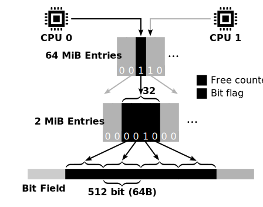

# LLFree: Lock- and Log-free Allocator

This repo contains the reimplementation of LLFree in C.

The two main design goals of this page frame allocator are multicore scalability and crash consistency.


**Related Projects**
- Rust-based LLFree: https://github.com/luhsra/llfree-rs
- Benchmarks: https://github.com/luhsra/llfree-bench
- Modified Linux: https://github.com/luhsra/llfree-linux
- Benchmark Module: https://github.com/luhsra/linux-alloc-bench


## Usage

Debug build
```sh
make
```

Release build
```sh
make DEBUG=0
```

Running unit-tests
```sh
make test
# or tests that contain "bitfield" in their name
make test A=bitfield
```


## Project Structure



In general, LLFree is separated into a lower allocator, responsible for allocating pages of 4K up to 4M, and an upper allocator, designed to prevent memory sharing and fragmentation.

The persistent lower allocator can be found in [lower.c](src/lower.c).
Internally, this allocator has 512-bit-large bit fields at the lowest level.
They stores which 4K pages are allocated.
The second level consists of 2M entries, one for each bit field. These entries contain a counter of free pages in the related bit field and a flag if the whole subtree is allocated as a 2M huge page.
These 2M entries are further grouped into trees with 32 entries (this can be defined at compile-time).

The [llc.c](src/llc.c) file contains the upper allocator, which depends on the lower allocator for the actual allocations and only manages the higher-level trees.
Its purpose is to improve performance by preventing memory sharing and fragmentation.
It is completely volatile and has to be rebuilt on boot.

## Publication

**LLFree: Scalable and Optionally-Persistent Page-Frame Allocation**<br>
Lars Wrenger, Florian Rommel, Alexander Halbuer, Christian Dietrich, Daniel Lohmann<br>
In: 2023 USENIX Annual Technical Conference (USENIX '23); USENIX Association
